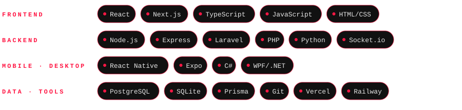

<div align="center">



<a href="https://sync-tuc.vercel.app"></a>
<a href="https://wa.me/543814019613"></a>
<a href="https://instagram.com/sync.tuc"></a>
<a href="mailto:eduwavee@gmail.com"></a>


</div>


```bash
$ cat edu.txt
nombre   : Eduardo "Edu" Velazques
base     : San Miguel de Tucumán, Argentina
marca    : Sync Solutions (freelance)
hago     : POS · plataformas web · inventarios · bots de WhatsApp · apps mobile
busco    : mi primer rol full-time como Full Stack
lema     : no hago demos, hago sistemas que se usan todos los días
```

🇦🇷 Soy Edu. Con **Sync Solutions** le armo software real a pymes: sistemas de caja, webs, inventario y bots. Ahora quiero llevar eso a un equipo full-time.

🇬🇧 I'm Edu. With **Sync Solutions** I build real software for small businesses: POS systems, web platforms, inventory and bots. Now I want to bring that to a full-time team.


<div align="center">
<a href="https://sync-tuc.vercel.app"></a>
</div>


<div align="center">

</div>


<table align="center">
<tr>
<td><a href="https://sync-tuc.vercel.app"></a></td>
<td><a href="https://github.com/eduwavee/ayudavecino-app"></a></td>
</tr>
<tr>
<td><a href="https://github.com/eduwavee/byemi"></a></td>
<td><a href="https://github.com/eduwavee/chapitag"></a></td>
</tr>
<tr>
<td><a href="https://sync-tuc.vercel.app"></a></td>
<td><a href="https://sync-tuc.vercel.app"></a></td>
</tr>
</table>


<div align="center">


</div>


<div align="center">

**¿Tenés un negocio y necesitás un sistema que funcione de verdad?** Escribime.

<a href="https://wa.me/543814019613"></a>


</div>
